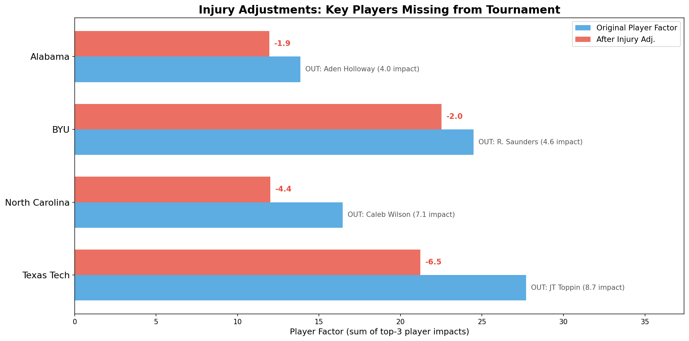
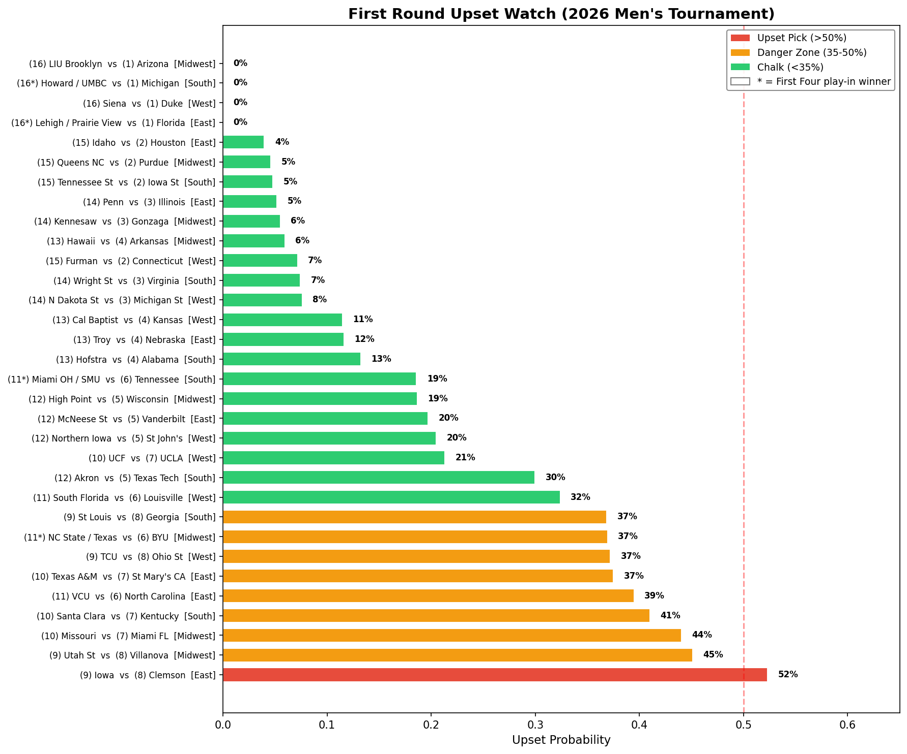
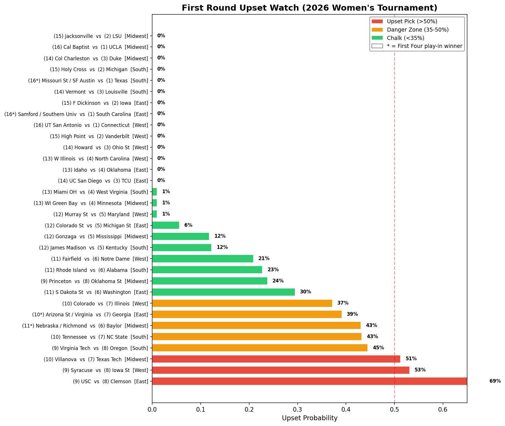

# Can a Machine Learning Model Pick Your Bracket? We Tried.

March Madness is back, and so is the chaos. Every year, millions of brackets get busted in the first round, and every year, we tell ourselves _this time will be different_. So we built a model to try and beat the madness.

## The Model

At its core, our model looks at every possible tournament matchup and predicts the point differential. That predicted margin then gets converted into a win probability through a gender-specific spline calibration.

We feed the model 39 features across several categories:

- **Season-long performance**: scoring, rebounding, turnovers, the stuff you see on the box score
- **Elo ratings**: a chess-inspired ranking system that updates after every game. We track not just the final rating, but trends. Is a team peaking? Fading? How tough was their schedule?
- **Computer rankings**: consensus rankings and a quality metric that adjusts for strength of opponents
- **Coach and player factors**: this is the secret sauce (more on this below)

We validated using Leave-One-Season-Out cross-validation. Hold out one tournament year, train on everything else, predict the held-out year. Repeat for every year from 2003 to 2025.

## Player and Coach Impact

## The Injury Edge: What Everyone Else Is Missing

Here's where we think we have a real advantage. Most models are frozen in time. They see the regular season stats and that's it. But March Madness doesn't care about your November box scores if your best player got injured in February.

We cross-referenced an injury report with our player impact data and found four tournament teams missing one of their top-3 players:

**Texas Tech** takes the biggest hit. JT Toppin (21.8 ppg) is out for the season with a knee injury, and he's their second most impactful player. That drops their player factor by 6.5 points, the largest adjustment in the tournament. They're a 5-seed, but after the adjustment our model ranks them closer to a 7 or 8-seed. Not great when you're staring down 12-Akron in round one.

**North Carolina** lost Caleb Wilson (19.8 ppg) to a thumb injury. Without him, their player factor drops by 4.4. As a 6-seed facing 11-VCU in the first round, this makes them genuinely vulnerable.

**BYU** and **Alabama** also lost key contributors in Richie Saunders and Aden Holloway, though the damage is smaller.

Our model automatically adjusts each team's predicted spread based on these injuries. When Texas Tech faces 12-Akron, the model isn't using the Texas Tech that went 24-7. It's using the Texas Tech that has to play without its second-best player.

## Upset Watch: Where the Bracket Breaks

So who's getting upset? Here's our model's first-round upset probability for every matchup:

**The big call: 9-Iowa over 8-Clemson (56%).** Our only outright upset pick. The Hawkeyes' efficiency numbers and late-season momentum give them a clear edge.

In the danger zone (35-50% upset probability):

- **10-Missouri vs 7-Miami FL (45%)**: basically a coin flip
- **9-Utah St vs 8-Villanova (46%)**: another toss-up
- **10-Santa Clara vs 7-Kentucky (40%)**: the Broncos can play with anyone
- **11-VCU vs 6-North Carolina (40%)**: the Caleb Wilson injury showing up in real time. Without him, UNC is barely a favorite

### Cinderella Watch

First-round upsets are fun. But the real magic of March is when a double-digit seed keeps winning. We calculated each mid-major's probability of making it through _two_ rounds to the Sweet 16, weighting the second-round opponent by how likely they are to actually be there:

| Team               | Seed | Region  | R1 Win | R2 Win | Sweet 16 Prob |
| ------------------ | ---- | ------- | ------ | ------ | ------------- |
| Missouri           | 10   | Midwest | 44%    | 25%    | 11.0%         |
| Texas / NC State\* | 11   | Midwest | 37%    | 27%    | 10.2%         |
| Akron              | 12   | South   | 30%    | 34%    | 10.1%         |
| Santa Clara        | 10   | South   | 41%    | 23%    | 9.5%          |
| VCU                | 11   | East    | 40%    | 23%    | 8.9%          |

**10-Missouri** is our top Cinderella pick. A near coin-flip against 7-Miami FL in round one, and if they pull it off they'd likely face 2-Purdue. That's a tough draw, but an 11% shot at the Sweet 16 as a 10-seed is real.

**12-Akron** might be the most interesting story here. They draw an injury-weakened Texas Tech missing JT Toppin, and their second-round numbers are the best of any double-digit seed at 34%. That's because if they win, they'd face the 4-13 winner, a more beatable path than running into a 1 or 2-seed.

\* _First Four play-in winner_

### Women's Tournament

The women's bracket has its own chaos brewing:

**9-USC over 8-Clemson (69%)** is by far our most confident upset pick across either tournament. That's not even close to a coin flip. **10-Villanova over 7-Texas Tech (51%)** and **9-Syracuse over 8-Iowa St (53%)** are two more the model likes. And keep an eye on **10-Tennessee vs 7-NC State (43%)**, a matchup that could go either way.

For Cinderellas on the women's side, **10-Virginia (East)** leads the way with a 9.3% chance of reaching the Sweet 16, followed by **10-Tennessee (South)** at 8.2%. Both have near coin-flip first-round matchups and viable second-round paths. **11-Nebraska/Richmond\*(Midwest)** are also worth watching with a combined ~5% Sweet 16 shot.

Interesting note: 9-USC has a 69% chance of beating 8-Clemson but only a 0.7% Sweet 16 probability because they'd run into 1-UConn in the second round. Winning one game is one thing. Surviving the bracket is another.

One important caveat on the women's side: our coach and player factor model only covers men's basketball because of data limitations, so the women's predictions run purely on the base model without the player-level adjustments. If there are key injuries on the women's side that we're not capturing, the model won't know about them.

\* _First Four play-in winner_

## Our Picks

**Men's champion: Arizona.** They grade out as the strongest overall team in the field, with elite Elo ratings and consistent performance across every metric. Duke is right behind them and would be a great pick too.

**Women's champion: UConn.** No surprise. They're the top-ranked team by a comfortable margin and have the highest average win probability against the rest of the field.

## What Could Go Wrong

No model can account for a player tweaking his ankle in warmups, a team dealing with internal issues, or the energy of a hostile crowd. That's the nature of single-elimination tournaments, and honestly, that's what makes March Madness the best event in sports.

What a model _can_ do is systematically incorporate information that most people overlook and give us a sharper edge on the margins.

Whether that's enough to survive the first weekend? We'll see.

Good luck with your brackets. You'll need it.

---

_Built for Kaggle's March Machine Learning Mania 2026 competition._
